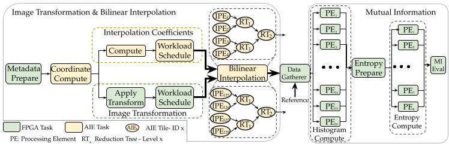

# Adaptive AIE–PL Systems for Efficient End-to-End Pyramidal 3D Image Registration

PeterPan is a novel Versal-based accelerator for **Pyramidal 3D rigid image registration** that follows a flexibility-oriented methodology for adaptive AI Engine designs.
PeterPan is designed to address the computational challenges in both key components of the registration process, **geometric transformation with interpolation** and **similarity metric** computation, by optimally mapping computational steps to heterogeneous hardware components on the [Versal VCK5000](https://japan.xilinx.com/content/dam/xilinx/publications/product-briefs/amd-xilinx-vck5000-product-brief.pdf).

## System architecture


*System Architecture Diagram: PeterPan integration with a CPU-based Powell optimizer for multi-modal 3D rigid image registration. Input images are used for an initial transformation and accelerated registration via PeterPan. The resulting MI is used by the Powell optimizer
to iteratively refine transformation parameters based on user-defined settings. The final output is a registered floating volume.*

## Requirements
- Hardware Device: Versal VCK5000 2022.2 QDMA Platform
- Vitis 2023.1
- XRT 2023.1
- OpenCV 4.0.0 - static library
- Python 3.8
- GCC 7.3.1
- ITK 5.3.0
- OS: Ubuntu 22.04
  
*Note: [NOT TESTED] As we do not use any OS-specific feature, different Linux-based OS versions may work as well.*

## OpenCV setup
To install OpenCV on your machine, use the following commands:
```
mkdir ~/opencv_build && cd ~/opencv_build
git clone https://github.com/opencv/opencv.git
git clone https://github.com/opencv/opencv_contrib.git
mkdir -p ~/opencv_build/opencv/build && cd ~/opencv_build/opencv/build

cmake -D CMAKE_BUILD_TYPE=Release -D CMAKE_INSTALL_PREFIX=/usr/local -D INSTALL_C_EXAMPLES=ON -D INSTALL_PYTHON_EXAMPLES=ON -D OPENCV_GENERATE_PKGCONFIG=ON -D CMAKE_INSTALL_PREFIX=$HOME/local -D BUILD_EXAMPLES=ON -D OPENCV_EXTRA_MODULES_PATH=~/opencv_build/opencv_contrib/modules ..

make -j
make install
```

To add your OpenCV to the PATH through the .bashrc file, modify the .bashrc file as follows:
```
export PKG_CONFIG_PATH=$HOME/local/lib/pkgconfig:$PKG_CONFIG_PATH
export LD_LIBRARY_PATH=$HOME/local/lib:$LD_LIBRARY_PATH
```

Depending on the system, some sub-dependencies may be needed: 
```
sudo apt install build-essential cmake git libgtk-3-dev pkg-config libavcodec-dev libavformat-dev libswscale-dev libv4l-dev libxvidcore-dev libx264-dev openexr libatlas-base-dev libopenexr-dev libgstreamer-plugins-base1.0-dev libgstreamer1.0-dev python3-dev python3-numpy libtbb2 libtbb-dev libjpeg-dev libpng-dev libtiff-dev libdc1394-dev gfortran -y
```

*NOTE: It may be needed to checkout the correct versions. Please refer to this link for installing instructions: https://learnopencv.com/install-opencv-3-4-4-on-ubuntu-18-04/*


## Code overview
- `3DIRG_application/`: complete registration framework
- `aie/`: AI Engines source code
- `common/`: constants and configuration generator
- `data_movers/`: PL kernels source code
- `hw/`: system integration and output bitstream
- `mutual_info/`: PL mutual information kernel source code from **[Hephaestus](https://dl.acm.org/doi/10.1145/3607928)**
- `soa/`: GPU 3D Image Registration from athena, with scripts for simplifying testing
- `sw/`: host source code
- `default.cfg`: architecture configuration parameters

## FCCM26 Artifact Evaluation
For artifact evaluation, see the [AE_peterpan.md](./AE_peterpan.md) file.

Zenodo DOI: [Link Zenodo](https://doi.org/10.5281/zenodo.19185342)

## Building

Two different designs are available for building:
- **TX** - Geometric transformation with interpolation
- **STEP** - Image registration step (geometric transformation + mutual information computation)

Moreover, design parameters can be set in the `default.cfg` file as described in the following sections.

### Flow

1. Source Vitis & XRT
    ```bash
    source <YOUR_PATH_TO_XRT>/setup.sh
    source <YOUR_PATH_TO_VITIS>/2022.1/settings64.sh
    ```
2. Move into the root folder of this repository & build the transformation standalone bitstream
    ```bash
    cd <your-path>/peterpan
    ```
3. Edit the `default.cfg` file to detail the configuration desired. 

    *For Transformation, relevant parameters are:*
    - `DIMENSION := ...` - represents the image resolution DIMENSION x DIMENSION. Choices = [1,2,4,8,16]
    - `INT_PE := ...` - Number of Interpolation Processing Elements. Choices: [1,2,4,8,16,32]
    - `PIXELS_PER_READ := ...` - represents the port width. [32,64,128]

    *For the rigid step, instead:*
    - `DIMENSION := ...` - represents the image resolution DIMENSION x DIMENSION, 512 for the paper
    - `HIST_PE := ...` - Histogram Processing elements for Mutual Information. Choices = [1,2,4,8,16]
    - `ENTROPY_PE := ...` - Entropy Processing elements for Mutual Information. Choices = [1,2,4,8,16]
    - `INT_PE := ...` - Number of Interpolation Processing Elements. Choices: [1,2,4,8,16,32]
    - `DS_PE := ...` - Number of Dispatcher Processing Elements [1,2,4,8]
    - `PIXELS_PER_READ := ...` - represents the port width. Choices: [32,64,128]
    - `FREQUENCY := ...` - design target frequency e.g., 240

4. Prepare the folder to be moved on the deploy machine (default name is `hw_build`).
    ```bash
    make build_and_pack TARGET=hw TASK=[TX|STEP] NAME=[NAME=<name>]
    ```
5. Move the generated folder, `build/NAME` (i.e. `cd build/hw_build`), to the deploy machine.
6. Follow the instructions in the  [AE_peterpan.md](./AE_peterpan.md) file to run the application on the deploy machine.

## Plotting Paper Figures
To plot each result figure in the paper, please refer to the corresponding folder under **paper_fig/.**
Each folder contains a subfolder with the figure name, and a dedicated readme for running. Per each figure, we provide some dedicated .csv files, containing sufficient numbers to replicate the paper result.


## Related Publications/Repository for Literature Comparison

- **[Hephaestus](https://dl.acm.org/doi/10.1145/3607928)** - Mutual Information & CPU-FPGA 3D image registration 
- **[Athena](https://doi.org/10.1109/BioCAS58349.2023.10388589)** - GPU-based 3D image registration
- **[Vitis Libraries](https://github.com/Xilinx/Vitis_Libraries/tree/2022.1)** - WarpAffine3D kernel for image transformation
- **[ITK](https://github.com/InsightSoftwareConsortium/ITK/)** powell-based 3D image registration
- **[SimpleITK](https://github.com/SimpleITK/SimpleITK)** powell-based 3D image registration

## Paper Citation

If you find this repository useful, please use the following citation:

```latex
@inproceedings{adaptiveaiepl26sorrentino,
  title={Adaptive AIE–PL Systems for Efficient End-to-End Pyramidal 3D Image Registration},
  author={Sorrentino, Giuseppe and Galfano, Paolo S. and Di Salvo, Claudio and  D'Arnese, Eleonora and Conficconi, Davide},
   booktitle={2026 IEEE Symposium on Field-Programmable Custom Computing Machines (FCCM)},
  pages={1-12},
  year={2026},
  doi="accepted--to--appear",
  selected={true}
}
```
